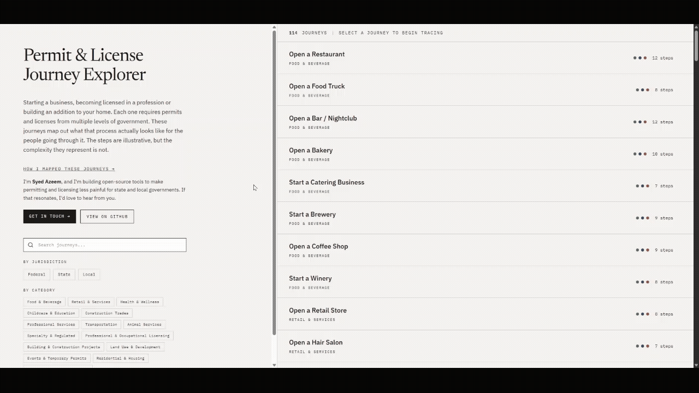

# Permitting & Licensing Journey Explorer

An interactive, editorial-grade dashboard mapping how common life and business journeys — opening a restaurant, becoming a nurse, building a home addition, hosting a street festival — require permits, licenses, and compliance steps scattered across **federal, state, and local government**.



_Above: the "Open a Restaurant" journey in dependency view, tracing how twelve permits and licenses connect across federal, state, and local jurisdictions. A full-quality [MP4 version](media/restaurant-journey.mp4) is also available._

**114 journeys** | **58 PLC types** | **15 categories** | **3 jurisdiction levels** | **4 phases**

## Stack

SvelteKit 2 · Svelte 5 (runes) · Vite 7 · TypeScript · Tailwind v4 · shadcn-svelte · GSAP.

## Develop

```bash
npm install
npm run dev          # vite dev server
npm run build        # production build
npm run preview      # preview the build
npm run check        # svelte-check (type + diagnostics)
```

## Data

All journey data lives in [`static/data/journeys.json`](static/data/journeys.json):

```
jurisdictions  — federal, state, local
categories     — 15 journey types (food, health, construction, …)
plcNodes       — 58 permit/license/compliance node types, with phase + metadata
journeys       — 114 journeys, each an ordered list of node IDs
```

See [`DATA_COLLECTION.md`](DATA_COLLECTION.md) for research methodology and [`docs/prd.html`](docs/prd.html) for the product spec.

## Deploy

Configured for **GitHub Pages** (fully static) via `@sveltejs/adapter-static`. A workflow at [`.github/workflows/deploy.yml`](.github/workflows/deploy.yml) builds the site on every push to `main` and publishes it via the `actions/deploy-pages` action.

To enable it on a fresh fork:

1. In the repo settings, go to **Pages** → set **Source** to **GitHub Actions**.
2. Push to `main` (or run the workflow manually from the Actions tab).

The workflow sets `BASE_PATH=/<repo-name>` at build time so asset and route URLs resolve correctly under the `https://<user>.github.io/<repo-name>/` subpath. For a user/organization root site (`<user>.github.io`), leave `BASE_PATH` unset.

The `/journey/[id]` route is rendered client-side via the SPA fallback (`404.html`), so direct links to individual journeys load correctly on GitHub Pages.

## License

[MIT](LICENSE)
